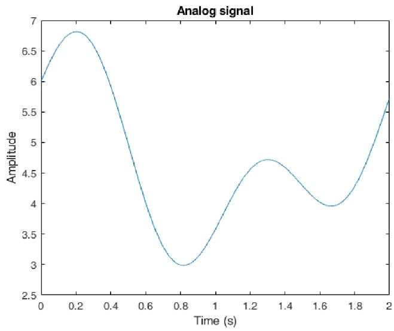
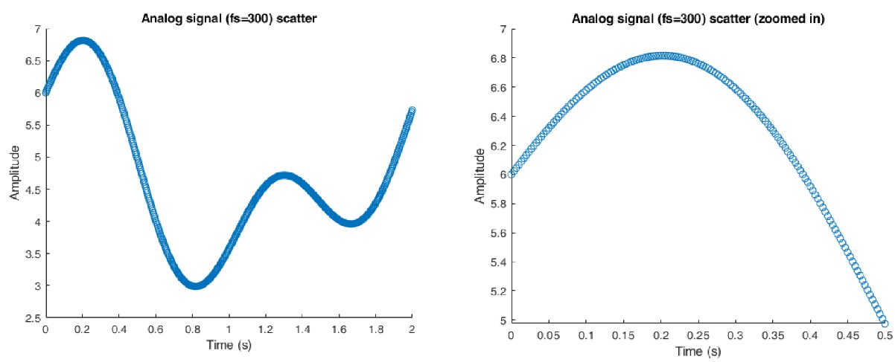
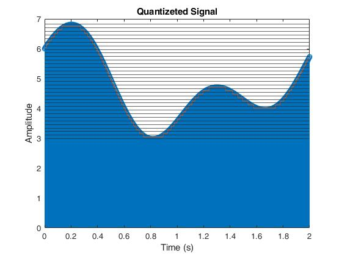
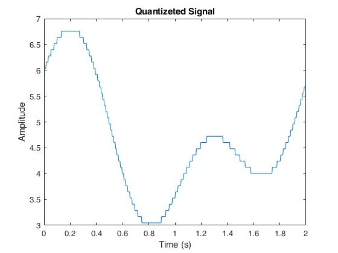
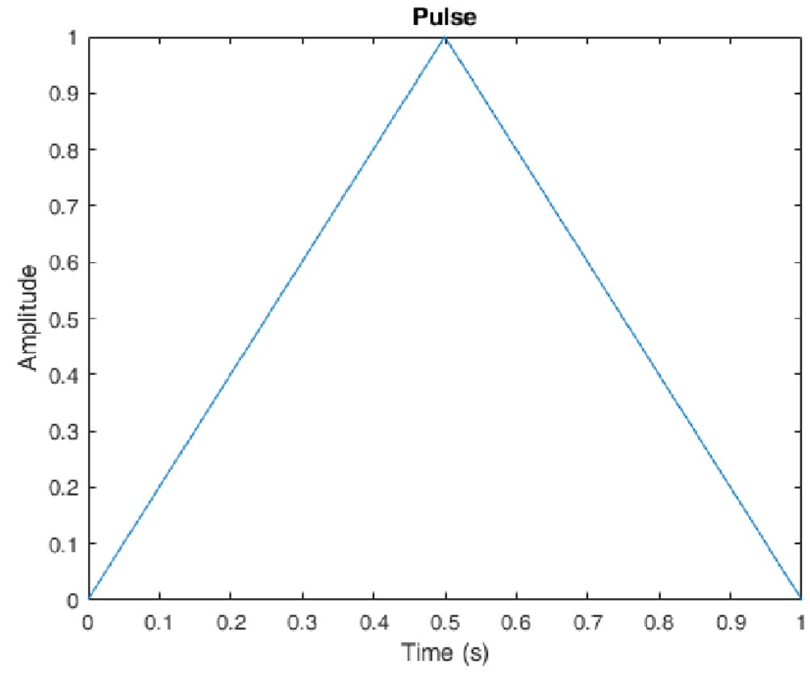
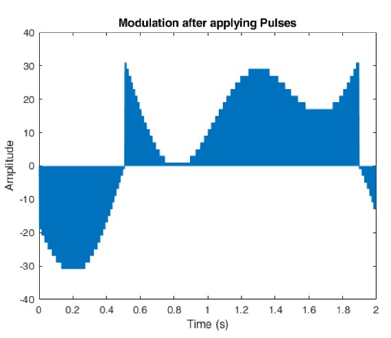
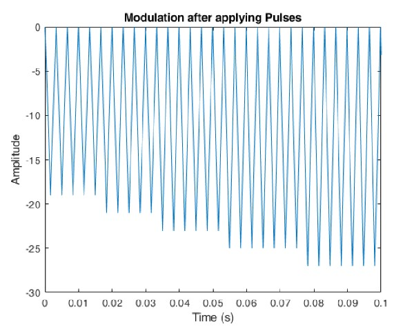
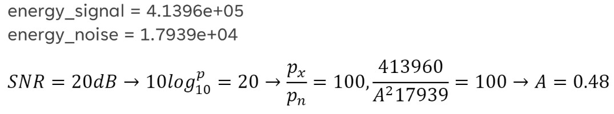
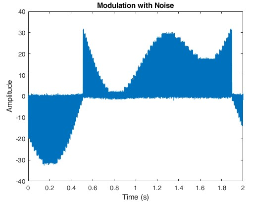

# RandomProcess & Quantization
Determining if given [random processes](https://github.com/fardinabbasi/RandomProcess-Quantization/blob/main/RandomProcess.mlx) are stationary processes(WSS) or not with statistical analysis MATLAB.

[Converting](https://github.com/fardinabbasi/RandomProcess-Quantization/blob/main/Quantization.mlx) an analog signal to digital to transfer & receive it in **MATLAB**.

## Random Process
$x_1(t) = cos(2\pi t+\phi); \phi \approx U[-\pi,\pi]$

$x_2(t) = cos(2\pi t+\phi); \phi \approx U[-\pi/4,\pi/4]$

Let's start by sampling from the random processes mentioned above at a frequency of $F_s = 100 Hz$. Next, we generate three sets of samples for $\phi$, containing 100, 1000, and 10000 samples respectively. Finally, here are the results for $x_1$ and $x_2$ using these different sample sizes.

| Mean of $x_1$ | Mean of $x_2$ |
| --- | --- |
|  |  |

Here are the exact values of the mean calculated manually.

$E[x_1] = 0$

$E[x_2] = 2[sin(2\pi t+\pi/4)+cos(2\pi t+\pi/4)]/\pi$

By increasing the number of samples in $x_1$, we observe a convergence of its mean towards **zero**, indicating that the **mean stationarity** condition is fulfilled. 
However, the mean of $x_2$ varies with time, thus violating the condition of **mean stationarity**. Consequently, $x_2$ cannot be considered a **stationary random process**.
| Sample Size | Autocorrelation function of $x_1$ | Autocorrelation function of $x_2$ |
| --- | --- | --- |
| 100 |  |  |
| 1000 |  |  |

Here are the exact values of the autocorrelation function calculated manually.

$R_{x_1} = cos(2\pi(t_1-t_2))/2 $
 
$R_{x_2} = cos(2\pi(t_1+t_2))/\pi + cos(2\pi(t_1-t_2))/2$

By analyzing the diagrams from the standpoint of a **constant time difference** ($\tau = t_1 - t_2$), we can conclude that the autocorrelation function of $x_1$ is **solely** determined by $\tau$, thus meeting the **criteria** for a **stationary random process**.

However, in the case of $x_2$, the autocorrelation function yields **different** values depending on $\tau$.

## Quantization
In this section, the $g(t)$ signal will undergo a **uniform quantization** process to convert it into a **digital** signal. Once received, the digital signal will be converted back into an **analog** signal.

$g(t) = 4 + sin(2\pi t) + cos(\pi t) + cos(\pi t/2) + tan(\pi t/6)$
### Sampling
To begin, an analog signal $g(t)$ was generated consisting of 15,000 points. Subsequently, the signal was sampled at a frequency of $fs = 300 Hz$. The obtained results are as follows.
| Analog Signal | Sampled Signal |
| --- | --- |
|  |  |
### Applying Quantization Levels
To perform **uniform quantization**, the range of the sampled signal amplitude was divided into 33 levels. The process was implemented using the following code.
```ruby
N = 33;
lines = linspace(min(g_sample),max(g_sample),N);
quantization = zeros(1,length(g_sample));
hold on
for k=1:length(lines)
    yline(lines(k));
end
for i=1:length(quantization)
    for j=1:length(lines)-1
        mean_two_line = (lines(j+1)+lines(j))/2;
        if(g_sample(i) >= lines(j) && g_sample(i) <= lines(j+1))
            quantization(i) = mean_two_line;
        end
    end
end
```
| Quantization levels | Quantized Signal |
| --- | --- |
|  |  |
### Digitalizing
This section describes the procedure of transmitting signals from the transmitter to the receiver using **PAM (Pulse Amplitude Modulation)** principles. For each quantized point **(Digit or Symbol)**, the base pulse is multiplied by a specific range before transmission.
| Base Pulse | Modulation Result | Modulation Result (Zoomed) |
| --- | --- | --- |
|  |  |  |

### Receiving the Digital Signal
The receiver will receive the signal along with **noise**, which is assumed to follow a **normal random process**. The **Signal-to-Noise Ratio (SNR)** is assumed to be 2dB.



```ruby
noise = normrnd(0,0.48,[1,length(modulate_signal)]);

signal_with_noise = modulate_signal + noise;
```
Here is the received signal with the aforementioned noise.



### Decoding
A policy has been implemented to convert the pulses into their corresponding digits, with the knowledge that each digit is sent in **1 second**.
The basic pulse is multiplied in the received pulse string for every second. By calculating their mutual energy and considering the energy of the basic pulse, the amplitude of each of these pulses is determined.
```ruby
for i=1:length(bits)
    noise_pulse = signal_with_noise(((i-1)*1000)+1:i*1000).*pulse;
    energy_each_pulse(i) = sum(noise_pulse) / energy_pulse;
end
```
Now, the energy_each_pulse values are compared with the two-dimensional array obtained from the Digitizing section in order to derive the quantization level.
```ruby
for i=1:length(energy_each_pulse)
    nearest_odd_number = energy_each_pulse(i);
    is_odd = mod(nearest_odd_number,2) < 1;
    nearest_odd_number = floor(nearest_odd_number);
    nearest_odd_number(is_odd) = nearest_odd_number(is_odd)+1;
    energy_each_pulse(i) = nearest_odd_number;
    for j=1:length(lines)-1
        if (energy_each_pulse(i) == TwoD_array(1,j))
            decode_signal(i) = TwoD_array(2,j);
        end
    end
end
```
<h2> Delta Modulation </h2>


